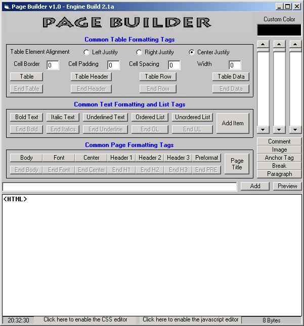



## PageBuilder v1\.0 e2\.1b

### Description

PageBuilder is a program that allows the user to make web pages by pointing and clicking (with minimal editing). PageBuilder currently supports the most commonly used HTML tags, CSS commands, JavaScript commands (editing is still required for the javascript to work properly), and XML, along with an XML previewer.
 
### More Info
 

             |
---                |---
**Submitted On**   |2004-03-19 23:12:32
**By**             |[Erick B\.](https://github.com/Planet-Source-Code/PSCIndex/blob/master/ByAuthor/erick-b.md)
**Level**          |Advanced
**User Rating**    |4.7 (14 globes from 3 users)
**Compatibility**  |VB 5\.0, VB 6\.0
**Category**       |[Internet/ HTML](https://github.com/Planet-Source-Code/PSCIndex/blob/master/ByCategory/internet-html__1-34.md)
**World**          |[Visual Basic](https://github.com/Planet-Source-Code/PSCIndex/blob/master/ByWorld/visual-basic.md)
**Archive File**   |[PageBuilde1722453202004\.zip](https://github.com/Planet-Source-Code/erick-b-pagebuilder-v1-0-e2-1b__1-52379/archive/master.zip)

